# BfResultProcessing


A Java desktop application built for university before final academic result management. 
Developed independently, the system supports two user roles — Admin and Teacher — and 
provides a complete workflow for managing students, courses, marks entry, and result 
processing. It handles lab marks, 2-credit and 3-credit course grading as many universities
in Bangladesh requires before final marks out of 40, teacher 
login and course distribution.

---

## Features

- Admin and Teacher login system
- Student registration and management
- Course combination and distribution management
- Lab marks entry
- Credit marks management (2 and 3 credit courses)
- Teacher information and registration
- Result processing and reporting
- MySQL database with full CRUD operations
-  Built entirely with Java Swing desktop UI

---

## Requirements

- Java 18 or higher — download from https://www.oracle.com/java/technologies/downloads/
- MySQL 8.0 — download from https://dev.mysql.com/downloads/mysql/
- phpMyAdmin (recommended for database setup)

---

## Installation & Setup

### Step 1 — Download the app
Go to the Releases page and download:
👉 [Download Latest Release](https://github.com/JoyitaGh/BfResultProcessing/releases/latest)

Download the file:
`BfResultProcessing-1.0-SNAPSHOT-jar-with-dependencies.jar`

### Step 2 — Set up the database
1. Open **phpMyAdmin** in your browser: `http://localhost/phpmyadmin`
2. Click **"New"** on the left panel
3. Create a database named exactly: `bfresult`
4. Click on the `bfresult` database
5. Click the **"Import"** tab
6. Click **"Choose File"** and select `database/schema.sql`
7. Click **"Go"**

### Step 3 — Configure database connection
The app connects to MySQL with:
- **Host:** localhost
- **Port:** 3306
- **Database:** bfresult
- **Username:** root
- **Password:** *(empty — no password)*

If your MySQL has a different username or password, edit this file before building:
```
src/main/java/db/myconnection.java
```

Change these lines to match your MySQL credentials:
```java
String username = "root";
String password = "";
```

### Step 4 — Run the application
Double-click the JAR file, or open terminal and run:
```
java -jar BfResultProcessing-1.0-SNAPSHOT-jar-with-dependencies.jar
```

> ⚠️ If double-clicking does not work, make sure Java 18 is installed on your PC.
> Verify by running `java -version` in your terminal.

---

## Build from Source

If you want to build the project yourself:

### Requirements
- JDK 18
- Maven
- NetBeans IDE (recommended)

### Steps
```bash
git clone https://github.com/JoyitaGh/BfResultProcessing.git
cd BfResultProcessing
mvn package
java -jar target/BfResultProcessing-1.0-SNAPSHOT-jar-with-dependencies.jar
```

---

## Screenshots

### Home
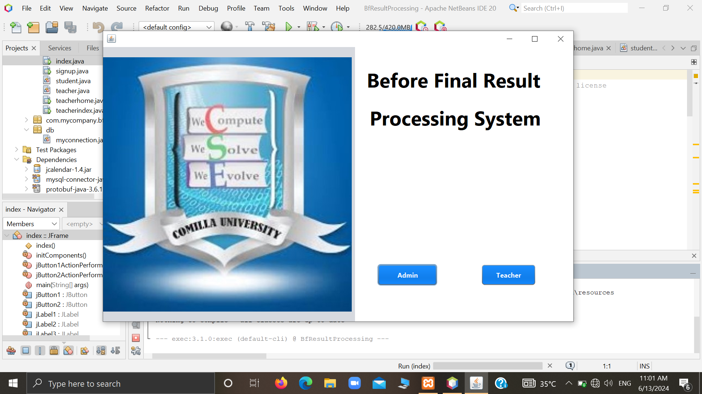

### Admin Login
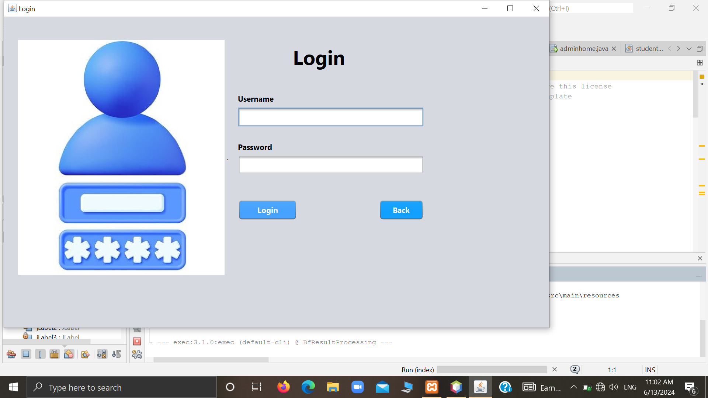

### Sign Up
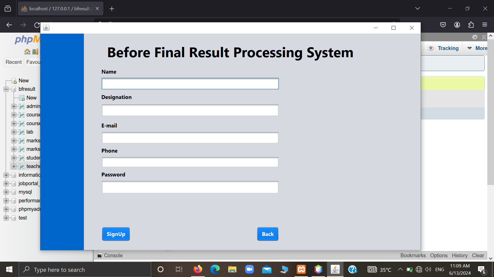

### Teacher Login
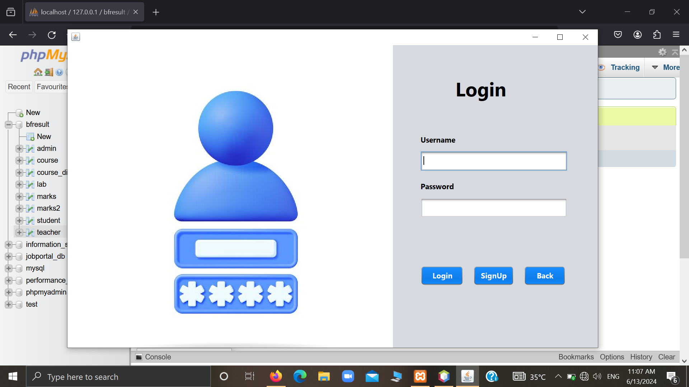

### Teacher Info
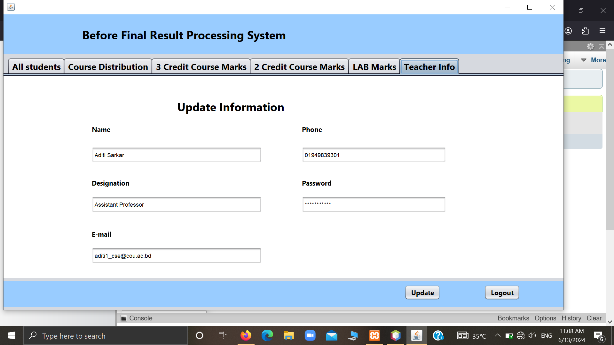

### Registered Teachers
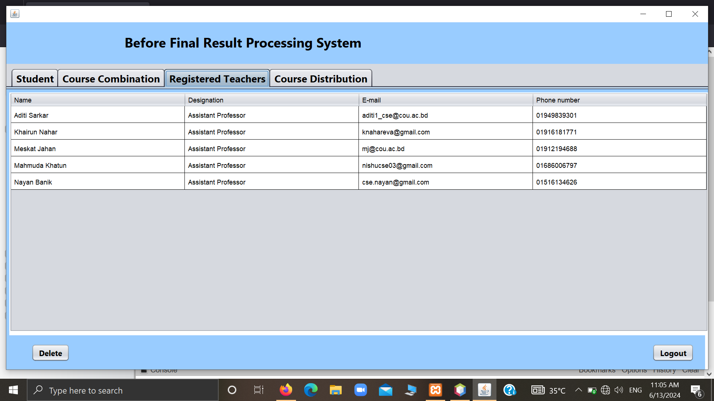

### Student Panel
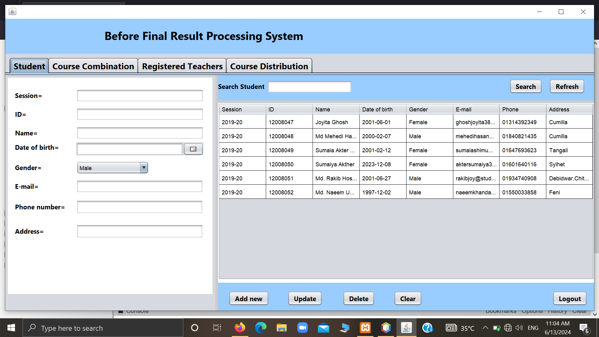

### All Students
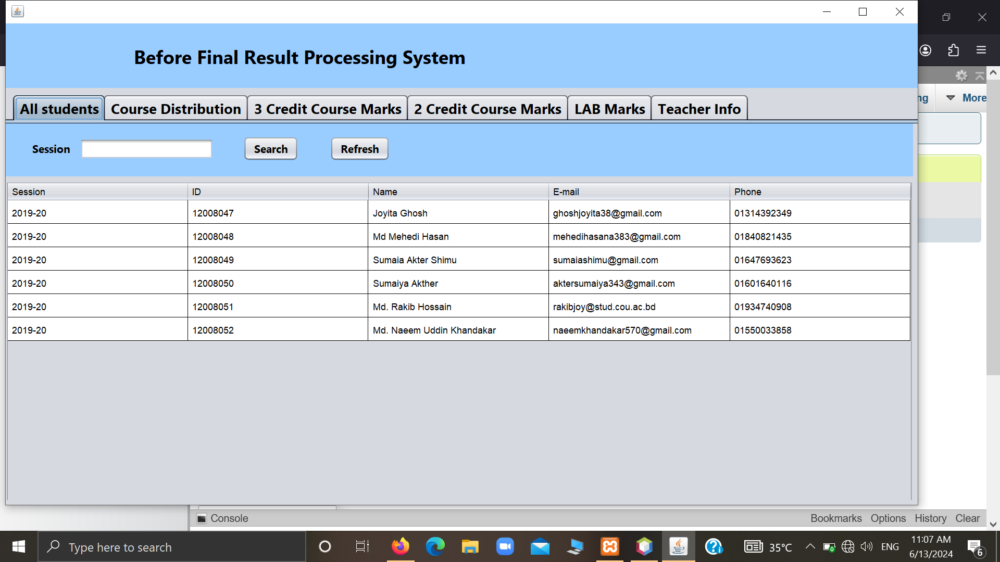

### Course Combination
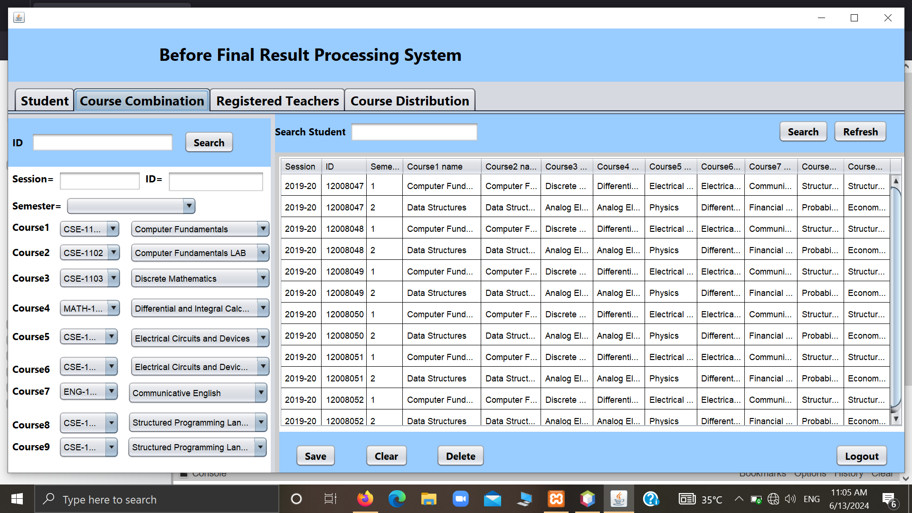

### Course Distribution
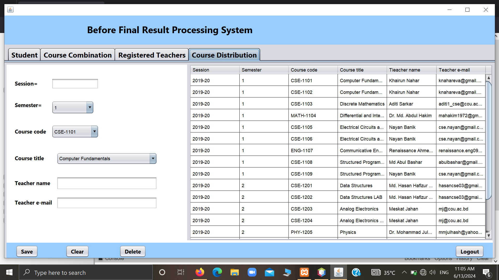

### Teacher Course Distribution
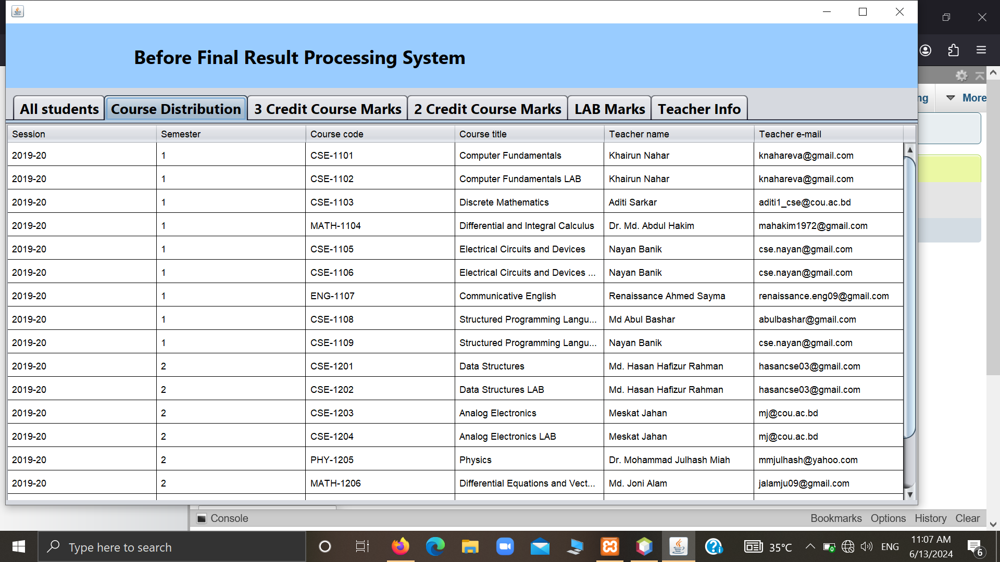

### Lab Marks


### 2 Credit Marks
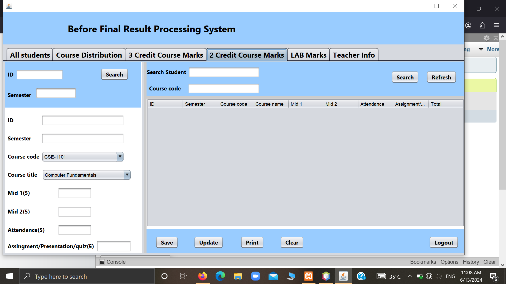

### 3 Credit Marks
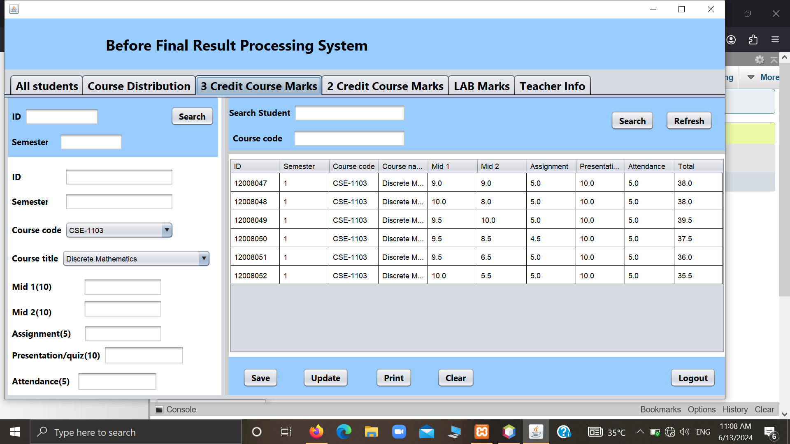

---

## Technologies Used

- Java 18
- Java Swing (Desktop UI)
- MySQL 8.0
- JDBC (Database connectivity)
- Maven (Build tool)
- JCalendar (Date picker)
- Protobuf
